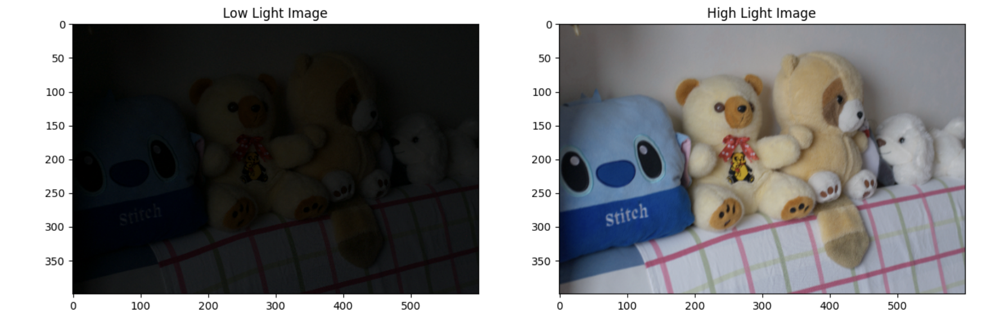
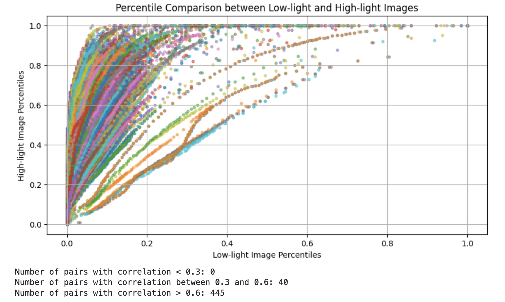
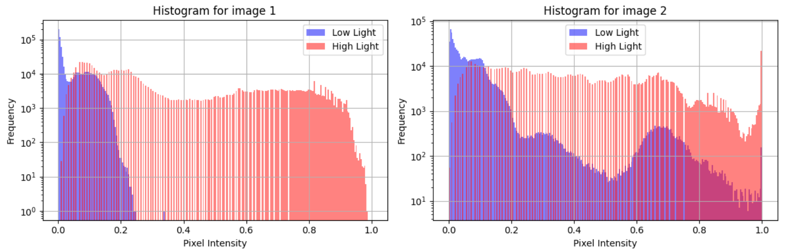
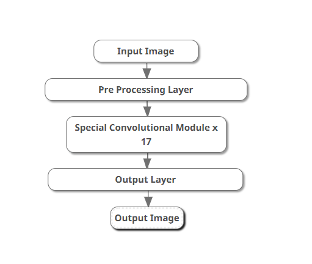
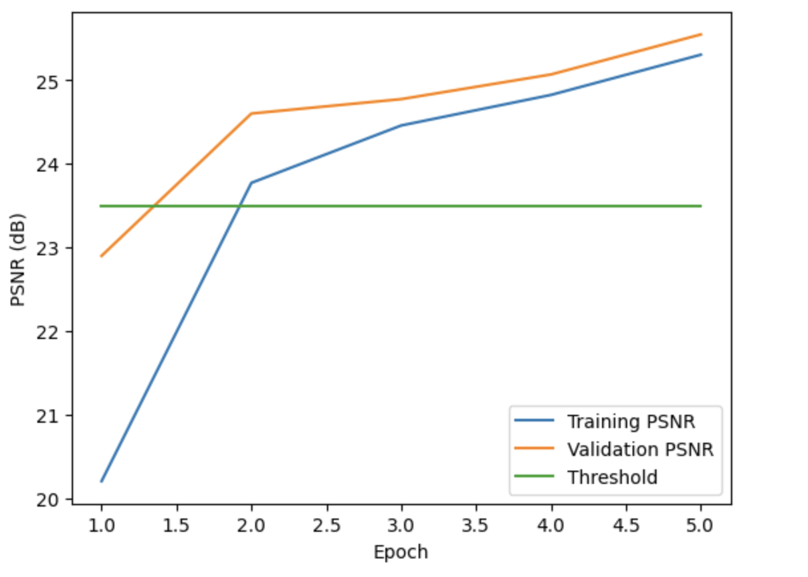

# Low-Light Image Enhancement

This repository contains all the necessary code and resources to enhance low-light images by reducing noise and converting them into high-light images. Our approach combines advanced neural network techniques with data preprocessing strategies to achieve superior image quality.

## Overview

In this project, we aim to improve the Peak Signal-to-Noise Ratio (PSNR) of low-light images. We have refined our neural network architecture with batch normalization, which helps stabilize and accelerate the training process. Additionally, we utilized histogram-based preprocessing techniques to generate more effective input images, leading to substantial improvements in PSNR scores.

## Table of Contents

1. [Dataset](#dataset)
2. [Exploratory Data Analysis and Preprocessing](#exploratory-data-analysis-and-preprocessing)
3. [Model and Architecture](#model-and-architecture)
    - [Preprocessing Layer](#preprocessing-layer)
    - [Special Convolutional Module](#special-convolutional-module)
    - [Output Layer](#output-layer)
    - [Main Model](#main-model)
4. [Losses and Training](#losses-and-training)
5. [Usage](#usage)

## Dataset

The dataset consists of 485 sets of paired images taken in both low-light and high-light conditions. Each set includes:
- A low-light image
- A corresponding high-light image



## Exploratory Data Analysis and Preprocessing

We begin by analyzing the percentiles of low-light and high-light images to identify significant correlations (≥ 0.6). Our preprocessing involves quantile regression models for histogram mapping, using an XGBoost regressor trained on the histogram data of low-light images.




## Model and Architecture

### Preprocessing Layer

The Preprocessing Layer applies initial convolutional operations to the input data, using a single convolutional layer with a 3x3 kernel size, followed by a ReLU activation function.

### Special Convolutional Module

This module processes data through two stages:
1. Two pathways in the first stage:
   - A 1x1 convolutional layer
   - Two 3x3 convolutional layers
2. Combined pathways in the second stage:
   - Two 3x3 convolutional layers
   - A shortcut connection (residual learning)


### Output Layer

The Output Layer generates the final feature representation through a single convolutional layer with a 3x3 kernel size and a sigmoid activation function.

### Main Model

The Main Model includes:
- An initial layer
- A series of special convolutional modules with skip connections
- A final layer with sigmoid activation



## Losses and Training

We employ a combined loss function minimizing MSE and MAE scores. Training is optimized with:
- AdamW optimizer
- Learning rate scheduler (ReduceLROnPlateau)
- Mixed precision training with `torch.cuda.amp.GradScaler`
- DataLoader for batching
- Early stopping based on validation loss

After training for 5 epochs, we achieved a PSNR score of 24.57.



## Usage

To use this repository, follow these steps:

1. **Clone the repository:**
   ```bash
   git clone https://github.com/yourusername/low-light-image-enhancement.git
2. **Install the required dependencies:**
   ```bash
   pip install -r requirements.txt
3. **Run the main script:**
   ```bash
   python main.py

